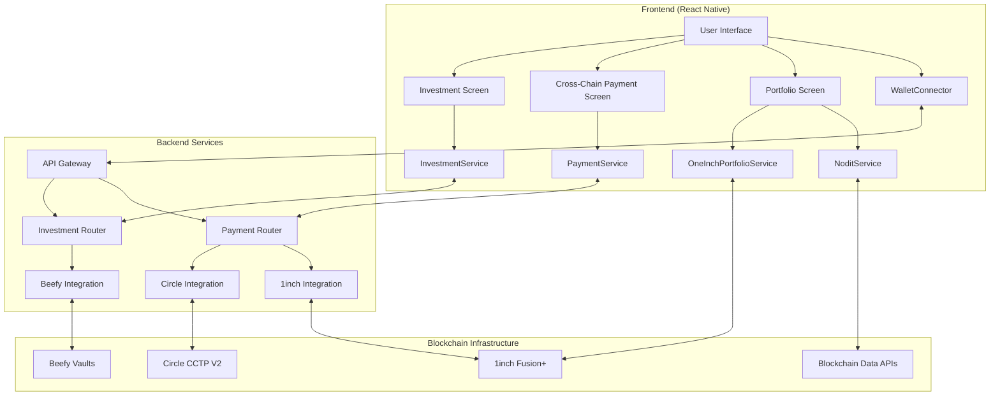
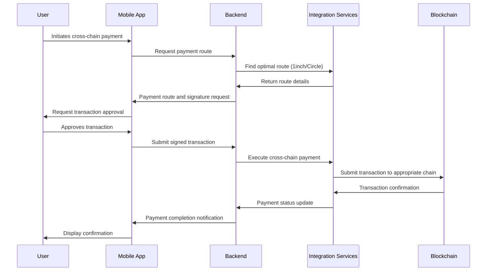
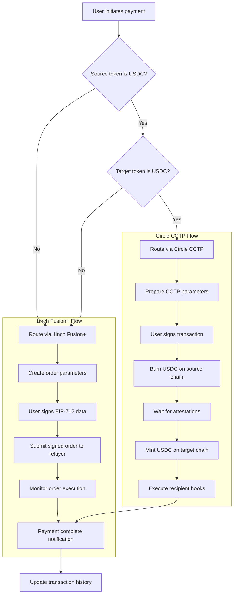
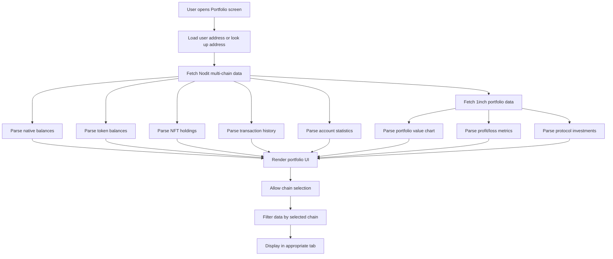
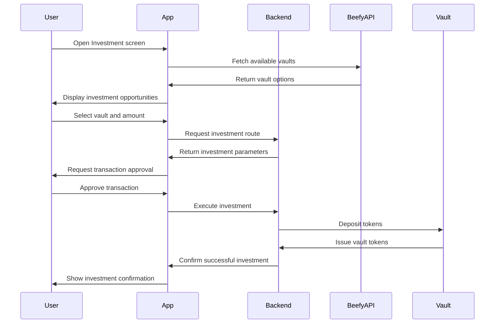

# PayCrossChain: Multi-Chain DeFi Super App


PayCrossChain is a comprehensive DeFi super-app that enables seamless cross-chain payments, yield optimization, and portfolio tracking across multiple blockchains. By leveraging cutting-edge blockchain interoperability protocols, PayCrossChain removes the complexity from cross-chain transactions, allowing users to interact with different blockchains through a single, intuitive interface.

## Table of Contents

- [Overview](#overview)
- [Key Features](#key-features)
- [Architecture](#architecture)
- [Core Technologies](#core-technologies)
  - [1inch Integration](#1inch-integration)
  - [Circle CCTP V2 Integration](#circle-cctp-v2-integration)
  - [Nodit Integration](#nodit-integration)
  - [Beefy Finance Integration](#beefy-finance-integration)
- [Technical Flows](#technical-flows)
  - [Cross-Chain Payment Flow](#cross-chain-payment-flow)
  - [Portfolio Tracking Flow](#portfolio-tracking-flow)
  - [Investment Flow](#investment-flow)
- [Development Setup](#development-setup)
- [Security Considerations](#security-considerations)
- [Future Roadmap](#future-roadmap)

## Overview

PayCrossChain revolutionizes how users interact with multi-chain DeFi by providing:

1. **Unified Cross-Chain Payments**: Send any token from any chain to any other chain with recipient preferences and conditional routing
2. **Yield Optimization**: Auto-compound investments across multiple chains through Beefy Finance vaults
3. **Advanced Portfolio Tracking**: Track multi-chain investments, performance metrics, and transaction history
4. **Gas Optimization**: Pay gas fees in USDC instead of native tokens

The app uses React Native for the frontend, Node.js for backend services, and directly interacts with various blockchain protocols.

## Key Features

### Cross-Chain Payments
- **Custom Payment Routing**: Set up payment preferences for different conditions (amount, token type)
- **Multiple Wallet Support**: Route payments to different wallets based on predefined conditions
- **1inch Fusion+ Integration**: Seamless cross-chain swaps without the need for manual bridging
- **CCTP V2 Support**: Fast USDC transfers across multiple chains (Ethereum, Avalanche, Base)

### Investments
- **Multi-Chain Vaults**: Invest in Beefy Finance vaults across multiple chains
- **Auto-Compounding**: Automatically reinvest yields for maximum returns
- **Investment Analytics**: Track performance and profits of your investments
- **Risk Assessment**: Each investment opportunity includes risk indicators

### Portfolio Tracking
- **Multi-Chain Visibility**: View all assets across supported chains
- **Performance Metrics**: Track ROI, profit/loss, and historical performance
- **Advanced Charts**: Visualize portfolio growth over time
- **Transaction History**: Complete history of all transactions across chains

### Gas Payment in USDC
- **Pay Gas in USDC**: Users can pay network fees using USDC instead of native tokens
- **Integrated Gas Estimation**: Automatically calculate and display gas costs

## Architecture

The PayCrossChain architecture consists of three main components:

1. **Mobile Frontend**: React Native with Expo
2. **Backend Services**: Node.js API server
3. **Smart Contracts**: On-chain logic for cross-chain operations

### System Architecture Diagram



### Data Flow Diagram



## Core Technologies

### 1inch Integration

PayCrossChain leverages two key 1inch products:

#### 1. 1inch Fusion+ for Cross-Chain Swaps

1inch Fusion+ provides gasless, MEV-protected cross-chain swaps through a private order execution system. Our integration works as follows:

1. **Order Creation**: When a user initiates a cross-chain payment, our backend:
   - Fetches the optimal swap route from 1inch API
   - Creates the order parameters with source and destination tokens/chains
   - Returns the data to be signed by the user

2. **Order Signing**: In the frontend, the user signs the EIP-712 typed data (without broadcasting any transaction)

3. **Order Submission**: The signed order is sent to our backend which:
   - Submits it to the 1inch Fusion+ network
   - Monitors the order status through polling
   - Notifies the user of successful execution

4. **Order Execution**: 1inch Fusion resolvers:
   - Execute the swap on the source chain
   - Bridge assets to the destination chain
   - Complete the swap on the destination chain
   - Deliver tokens to the recipient

Implementation details can be seen in `CrossChainPayment.tsx` where we handle order preparation, signing, and monitoring:

```typescript
// Order preparation via backend
const processResponse = await apiClient.post('/payment/process', {
  senderAddress,
  recipientAddress: actualRecipient,
  sourceChainId: sourceChain.id,
  sourceToken: sourceToken.address,
  amount: ethers.utils.parseUnits(amount, sourceToken.decimals).toString(),
  targetChainId: targetChainId,
  targetToken: targetTokenAddress,
  routeType: 'inch_fusion',
  note: note,
});

// Order signing with user's wallet
signature = await signer._signTypedData(
  domain,
  { Order: types.Order },
  value
);

// Order submission to 1inch network
const finalizeResponse = await apiClient.post('/payment/inch/finalize', {
  srcChainId: orderData.srcChainId,
  orderStruct: orderData.orderStruct,
  quoteId: orderData.quoteId,
  secretHashes: orderData.secretHashes,
  signature: signature,
  extension: orderData.extension,
  orderHash: orderData.orderHash
});
```

#### 2. 1inch Portfolio API for Investment Tracking

The 1inch Portfolio API provides detailed information about user assets, historical performance, and investment analytics. Our integration enables:

1. **Asset Tracking**: Viewing all tokens and their values across chains
2. **Performance Analysis**: Tracking profit/loss and ROI over different time periods
3. **Historical Data**: Displaying value charts over time

The implementation is encapsulated in `OneInchPortfolioService.ts`:

```typescript
// Get token values for an address
static async getTokenValues(address: string, chainId: number) {
  const response = await oneInchClient.get('/overview/erc20/current_value', {
    params: {
      addresses: [address],
      chain_id: mappedChainId
    }
  });
  return response.data.result?.[0]?.tokens || [];
}

// Get profit/loss data for an address
static async getProfitAndLoss(address: string, chainId: number, timerange: TimeRange = '1month') {
  const response = await oneInchClient.get('/overview/erc20/profit_and_loss', {
    params: {
      addresses: [address],
      chain_id: mappedChainId,
      timerange
    }
  });
  return response.data.result || [];
}

// Get portfolio value chart data
static async getValueChart(address: string, chainId: number, timerange: TimeRange = '1month') {
  const response = await oneInchClient.get('/general/value_chart', {
    params: {
      addresses: [address],
      chain_id: mappedChainId,
      timerange
    }
  });
  return response.data.result || [];
}
```

### Circle CCTP V2 Integration

Circle's Cross-Chain Transfer Protocol (CCTP) V2 enables fast, secure, and direct USDC transfers across supported blockchains. Our integration works as follows:

1. **Message Passing**: When a user initiates a USDC transfer across chains:
   - USDC is burned on the source chain
   - A message is emitted containing the details of the transfer
   - Circle validators attest to the burn event
   - USDC is minted on the destination chain

2. **Hook Data**: We extend CCTP capabilities by adding hook data for:
   - Transferring tokens to a specific recipient after minting
   - Depositing directly into investment vaults
   - Managing conditional transfers based on preferences

Implementation in `CrossChainPayment.tsx`:

```typescript
if (paymentRouteData && paymentRouteData.routeType === 'circle_cctp') {
  try {
    // Create hook data for the transfer
    const amountInWei = ethers.utils.parseUnits(amount, sourceToken!.decimals).toString();
    
    // Generate hookData for sending to recipient or vault
    const hookData = encodeFunctionData({
      abi: [
        {
          constant: false,
          inputs: [
            { name: "_to", type: "address" },
            { name: "_value", type: "uint256" },
          ],
          name: "transfer",
          outputs: [],
          payable: false,
          stateMutability: "nonpayable",
          type: "function",
        },
      ],
      functionName: "transfer",
      args: ["0x0c07BE7E39719777F2C0343114116aC4368e099F" as `0x${string}`, BigInt(amountInWei)]
    });

    // Execute the direct Circle transfer
    await executeTransfer(
      Number(sourceChain!.id), 
      Number(targetChainId), 
      amount, 
      actualRecipient,
      hookData as `0x${string}`
    );
  } catch (error) {
    console.error('Error executing Circle transfer:', error);
  }
}
```

### Nodit Integration

Nodit provides on-chain data and portfolio analytics across multiple blockchains. Our integration enables:

1. **Portfolio Tracking**: View all assets (tokens and NFTs) across chains
2. **Transaction History**: Complete history with detailed transaction information
3. **Address Lookup**: View any wallet's assets and transactions
4. **ENS Resolution**: Translate between ENS names and Ethereum addresses

The implementation is in `NoditService.ts` and is used extensively in the Portfolio screen:

```typescript
// Get ENS name for an address
static async getEnsNameByAddress(address: string) {
  const response = await noditClient.get(`/ethereum/mainnet/address/${address}/ens`);
  return response.data || { name: null };
}

// Get native balance for an account on a specific chain
static async getNativeBalance(address: string, chainId: number) {
  const { protocol, network } = this.getChainInfo(chainId);
  const response = await noditClient.post(`/${protocol}/${network}/balances/native`, {
    address
  });
  return response.data || { balance: '0', balanceUSD: '0' };
}

// Get multi-chain portfolio data
static async getMultiChainPortfolio(address: string) {
  const result: ChainData[] = [];
  
  for (const chain of SUPPORTED_CHAINS) {
    try {
      // Get native balance
      const nativeBalance = await this.getNativeBalance(address, chain.id);
      
      // Get token balances
      const tokens = await this.getTokenBalances(address, chain.id);
      
      // Get NFTs
      const nfts = await this.getNFTs(address, chain.id);
      
      // Get account stats
      const stats = await this.getAccountStats(address, chain.id);
      
      result.push({
        chainId: chain.id,
        chainName: chain.name,
        nativeBalance,
        tokens,
        nfts,
        stats
      });
    } catch (error) {
      console.error(`Error fetching data for chain ${chain.id}:`, error);
    }
  }
  
  return result;
}
```

## Technical Flows

### Cross-Chain Payment Flow

The cross-chain payment flow involves selecting the optimal route between 1inch Fusion+ and Circle CCTP V2 based on the tokens and chains involved:



### Portfolio Tracking Flow

The portfolio tracking system combines data from Nodit and 1inch Portfolio API:



### Investment Flow

The investment flow for Beefy Finance vaults:



## Development Setup

### Prerequisites
- Node.js v18+ and npm/yarn/bun
- Expo CLI
- Android Studio or Xcode for mobile development
- MetaMask or other Web3 wallet

### Frontend Setup
```bash
# Clone the repository
git clone https://github.com/kamalbuilds/paycrosschain.git
cd paycrosschain

# Install frontend dependencies
cd frontend
npm install

# Set up environment variables
cp .env.example .env
# Edit .env with your API keys

# Start the frontend app
npx expo start
```

### Backend Setup
```bash
# Install backend dependencies
cd ../backend
npm install

# Set up environment variables
cp .env.example .env
# Edit .env with your API keys

# Start the backend server
npm run dev
```

### Smart Contracts Setup
```bash
# Install contract dependencies
cd ../contracts
npm install

# Compile contracts
npx hardhat compile

# Deploy to test network
npx hardhat run scripts/deploy.js --network sepolia
```

## Security Considerations

1. **API Keys**: All API keys are stored securely in environment variables and never exposed to the client
2. **Order Signing**: All orders are signed locally on the device before submission
3. **Secure Backend**: The backend validates all signatures and prevents unauthorized access
4. **Error Handling**: Comprehensive error handling prevents transaction failures
5. **Polling with Retry**: Robust polling mechanisms with exponential backoff for reliability

## Future Roadmap

1. **Additional Chains**: Support for Solana, Polkadot, and other ecosystems
2. **Smart Notifications**: Alert users about optimal investment opportunities
3. **Fiat On/Off Ramps**: Direct fiat integration with credit/debit cards
4. **Advanced Analytics**: Machine learning-based investment recommendations
5. **Social Features**: Share investment strategies with friends and followers

---

Built with ❤️ by the PayCrossChain team.
